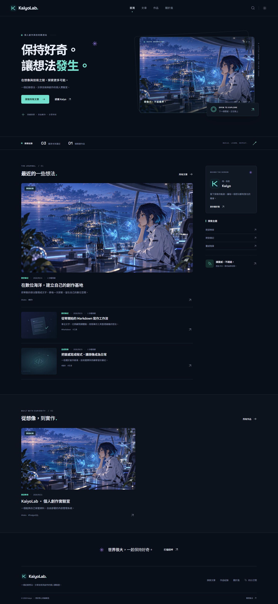
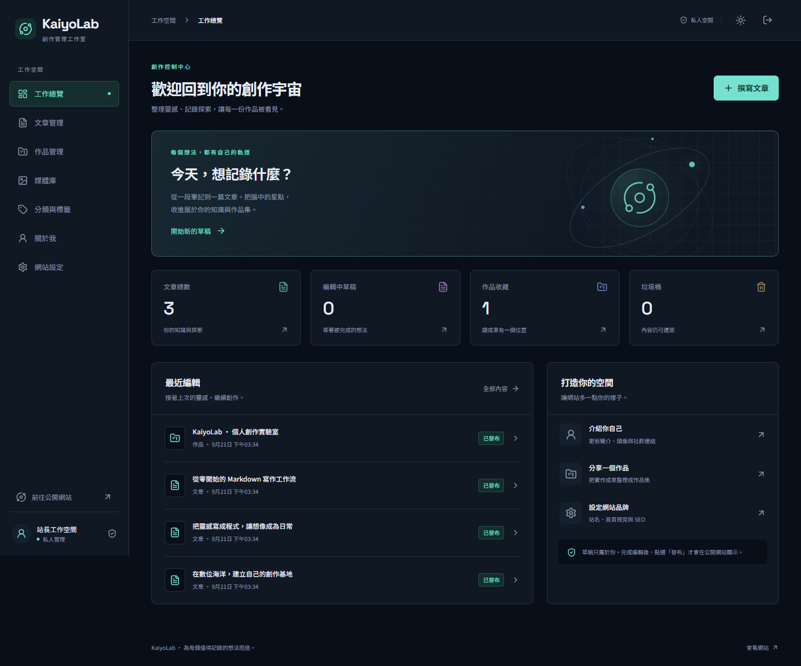

# KaiyoLab

**把想法寫成文章，讓作品有自己的位置。**

KaiyoLab 是可以自行部署的個人內容管理系統，結合公開文章網站與私人管理後台。以深海藍、青色與動漫科技視覺建立自己的品牌，透過 Markdown 管理文章與作品，發布後立即呈現在網站。

[快速開始](#快速開始) · [功能](#功能) · [正式部署](docs/deployment.md) · [備份與還原](docs/backup-restore.md) · [參與開發](CONTRIBUTING.md)





## 快速開始

需要已啟動的 Docker Engine 或 Docker Desktop（Linux 容器），以及 Docker Compose v2.24.4 以上。第一次啟動需要網路以下載依賴與映像。

下載專案並進入目錄：

```bash
git clone https://github.com/Andy61490963/KaiyoLab.git
cd KaiyoLab
```

**一行啟動網站、後台與資料庫：**

```bash
docker compose up -d
```

第一次會自動建置應用程式、產生隨機密鑰、建立 PostgreSQL 資料庫並執行 migration，不需要先建立 `.env`。

1. 執行 `docker compose logs app`，取得「一次性初始化碼」。
2. 開啟 [http://localhost:4321/setup](http://localhost:4321/setup)，輸入初始化碼、站長 Email、密碼與網站名稱。
3. 完成後前往 [私人後台](http://localhost:4321/admin)，開始新增文章與作品。

初始化只允許建立一位站長，完成後關閉註冊入口。網站只綁定本機 `127.0.0.1`；其他人需要透過你的正式網域與 HTTPS 存取，請參考[正式部署](docs/deployment.md)。

確認狀態：

```bash
docker compose ps -a
docker compose logs --tail=100 app
```

`init-secrets` 顯示 `Exited (0)` 表示一次性初始化服務成功；`app` 與 `db` 應持續執行並通過健康檢查。

## 功能

| 公開網站                              | 私人後台                               |
| ------------------------------------- | -------------------------------------- |
| 首頁、文章、作品與關於我              | 真實內容數量與最近修改總覽             |
| 分類、標籤、中文關鍵字搜尋與分頁      | Markdown 編輯、格式工具列、即時預覽    |
| 文章目錄、閱讀時間、程式碼高亮與複製  | 自動儲存、編輯衝突提示、草稿預覽       |
| 精選文章、作品展示與相關文章          | 發布、發布更新、下架、置頂及垃圾桶還原 |
| 明暗主題、響應式排版與減少動態        | 分類、標籤、媒體庫與替代文字管理       |
| RSS、sitemap、canonical 與 Open Graph | 網站品牌、社群連結、SEO 與密碼管理     |

文章的「正在編輯的草稿」與「公開版本」分開保存。修改已發布文章時，訪客會繼續看到上一個發布版本，直到你按下「發布更新」。未發布內容、私人預覽與管理 API 都要求站長登入。

Markdown 支援表格、任務清單與程式碼區塊，文章不執行 JavaScript 或 MDX。圖片保存於 Docker volume，媒體庫會防止刪除仍被內容使用的圖片。

第一版適合**一個網站、一位站長**。不包含公開註冊、留言、電子報、多租戶、排程發布、拖拉版面或完整歷史版本管理。

## 技術架構

| 層次         | 使用技術                                                 |
| ------------ | -------------------------------------------------------- |
| 伺服器與路由 | Astro 7、TypeScript、官方 Node adapter，SSR 即時讀取內容 |
| 互動介面     | React islands、Tailwind CSS、Radix UI、Lucide            |
| 編輯器與文章 | CodeMirror、remark／rehype、Shiki                        |
| 資料         | PostgreSQL 18、Drizzle ORM、可重複執行的 migration       |
| 驗證         | Better Auth Email／密碼、資料庫 Session、單站長初始化    |
| 執行環境     | Node.js 24、Docker Compose                               |
| 品質驗證     | Astro check、Vitest、PostgreSQL 整合測試、Playwright     |

```text
瀏覽器 ── HTTPS／本機 HTTP ── Astro 應用程式
                              ├─ 公開網站
                              ├─ 私人後台與 API
                              ├─ PostgreSQL 容器 → pg_data volume
                              └─ 圖片檔案 → uploads volume
首次初始化服務 → secrets volume → 應用程式與資料庫
```

前台、後台與 API 由同一個應用程式容器提供。資料庫連接埠不對主機公開；應用程式以非 root 使用者執行。PostgreSQL 18 的持久化掛載點為 `/var/lib/postgresql`。

主要公開路由：`/`、`/articles`、`/articles/[slug]`、`/projects`、`/projects/[slug]`、`/about`、`/rss.xml`、`/sitemap.xml`。私人後台為 `/admin`，登入與首次設定分別為 `/login`、`/setup`。

## 設定與操作

本機預設無須修改環境變數。需要自訂時，將 `.env.example` 複製為 `.env`。

| 設定                 | 預設值                   | 用途                                           |
| -------------------- | ------------------------ | ---------------------------------------------- |
| `SITE_URL`           | `http://localhost:4321`  | 建置及執行期的完整網址；變更後須 `--build`     |
| `APP_PORT`           | `4321`                   | 本機對應連接埠；變更時也要同步 `SITE_URL`      |
| `DOMAIN`             | 無                       | 正式部署的唯一網域來源，建置及執行統一為 HTTPS |
| `DATABASE_URL`       | 由容器密鑰組成           | 本機 npm 開發時指定 PostgreSQL 連線            |
| `BETTER_AUTH_SECRET` | 首次隨機產生             | 本機 npm 開發須自行設定隨機值                  |
| `SETUP_TOKEN`        | 首次隨機產生             | 首次設定用的一次性初始化碼                     |
| `UPLOAD_DIR`         | 容器 `/app/data/uploads` | 圖片儲存目錄；本機開發可使用 `./data/uploads`  |
| `SECRETS_DIR`        | `/run/kaiyo-secrets`     | 容器密鑰檔案目錄                               |

Compose 不會將 `.env` 中的全部值自動傳給容器；Docker 的資料庫密碼、Auth 密鑰與初始化碼以 named volume 保存。上表的本機開發變數僅供 `npm` 工作流程使用。

停止並保留資料：

```bash
docker compose down
```

再次啟動：

```bash
docker compose up -d
```

`pg_data`、`uploads`、`secrets` 都會保留。**不要在仍需要資料時執行 `docker compose down -v`**；它會永久刪除這個 Compose 專案的資料庫、圖片與密鑰 volumes。

### 密碼復原

不需要配置 Email 寄信。擁有部署主機操作權限的人可執行：

```bash
docker compose exec app npm run account:recover
```

指令會產生新的隨機密碼並讓所有既有 Session 登出；使用新密碼登入後，請在後台變更為自己的密碼。請勿將這段終端機輸出貼到公開 issue。

### 更新與回復

1. 依照[備份說明](docs/backup-restore.md)保存資料庫、圖片與密鑰。
2. 更新到所需的版本標籤或 commit。
3. 執行 `docker compose up -d --build --wait`，啟動時會自動執行 migration。
4. 檢查首頁、登入、圖片與 `/api/health`。

Migration 失敗時應用程式不會開始服務，請先查看日誌並修正原因。回退程式版本不會自動逆轉資料庫結構；若新版 migration 不相容，請把更新前的完整備份還原到新的 Compose 專案，再切換流量。

## 開發

需要 Node.js 24 與 PostgreSQL 18。建立本機專用資料庫、設定 `DATABASE_URL`、`BETTER_AUTH_SECRET`、`SETUP_TOKEN` 和 `SITE_URL=http://localhost:4321`，不要使用正式資料庫進行測試。

```bash
npm ci
node --env-file=.env scripts/migrate.mjs
node --env-file=.env node_modules/astro/bin/astro.mjs dev --host 127.0.0.1 --ignore-lock
```

伺服器端讀取 `process.env`，上述指令使用 Node 24 的 `--env-file` 明確載入 `.env`，並以前景模式啟動開發伺服器。資料庫維護指令也使用相同設定：

```bash
node --env-file=.env scripts/migrate.mjs
```

獨立啟動本機開發資料庫的範例，密碼請替換為自己產生的隨機值：

```bash
docker run -d --name kaiyolab-dev-db -p 127.0.0.1:5432:5432 -e POSTGRES_USER=kaiyo -e POSTGRES_DB=kaiyolab -e POSTGRES_PASSWORD=請替換成隨機密碼 -v kaiyolab_dev_pg:/var/lib/postgresql postgres:18-bookworm
```

新增資料結構變更時，請加入新的版本化 migration，不修改已發布的 migration。正式啟動會先執行 migration，成功後才啟動 Astro。

檢查與測試：

```bash
npm run check
npm test
npm run test:integration
npm run build
npx playwright install chromium
npm run test:e2e
```

整合測試需要 `DATABASE_URL` 及可建立測試資料庫的 PostgreSQL 帳號，未提供連線時會略過；瀏覽器測試需要獨立的空白測試站或對應站長帳號。可直接執行的跨平台指令、Astro 前景模式與測試環境設定見[本機開發與測試](docs/development.md)。CI 會在 Linux 上驗證 Docker 全新啟動、瀏覽器操作、容器重建與備份還原；版本標籤 `v*` 會觸發 amd64／arm64 映像發布至 GHCR。工作流程存在不代表該次驗證已成功，請以 GitHub Actions 的執行結果為準。

## 常見問題

**第一次無法立即打開網站？**

映像建置與套件下載需要時間。先執行 `docker compose ps -a` 與 `docker compose logs --tail=100 app db`。Docker Desktop 必須已啟動並使用 Linux containers。

**初始化碼在哪裡？**

`docker compose logs app` 會在首次設定前顯示初始化碼；完成設定後，重啟不再顯示。若初始化後忘記密碼，請使用帳號復原指令。

**換了本機 port 後無法登入？**

把 `APP_PORT` 與 `SITE_URL` 同步，例如 `APP_PORT=8080`、`SITE_URL=http://localhost:8080`，再執行 `docker compose up -d`。瀏覽器網址必須與設定的來源一致。

**為什麼編輯文章後前台沒有變？**

自動儲存保留草稿；按下「發布更新」才更新公開版本。

**怎麼讓別人看到網站？**

使用自己的網域與 [Caddy HTTPS 部署](docs/deployment.md)，將 DNS 指向主機並開放 80／443。預設 4321 僅接受本機連線。

**資料庫出現密碼驗證錯誤？**

既有 PostgreSQL volume 的密碼不會因環境變數變更而重設。請確認資料庫與 `secrets` 是同一份部署／備份，勿只刪除密鑰 volume 再重啟。

**如何完整備份？**

資料庫備份不含圖片，請一併備份 `uploads` 與 `secrets`。[備份與還原文件](docs/backup-restore.md)提供可直接執行的步驟。

## 開源與素材

程式碼採 [MIT 授權](LICENSE)，保留原有授權聲明。歡迎閱讀[貢獻指南](CONTRIBUTING.md)。

設計方向參考 [Codfisher 的 cod-aquarium](https://github.com/Codfisher/cod-aquarium) 的閱讀感與留白，KaiyoLab 的介面與素材獨立實作，未直接複製其品牌或文章。字體及套件保留各自授權；詳見[素材與第三方授權](docs/credits.md)及[視覺素材來源](docs/assets.md)。

相關官方文件：[Astro Node adapter](https://docs.astro.build/en/guides/integrations-guide/node/)、[PostgreSQL 容器](https://hub.docker.com/_/postgres)、[Compose 啟動順序](https://docs.docker.com/compose/how-tos/startup-order/)。
