# KaiyoLab

**自行部署的文章、作品與前端工具網站，附私人管理後台**

[](https://github.com/Andy61490963/KaiyoLab/actions/workflows/ci.yml)
[](https://github.com/Andy61490963/KaiyoLab/actions/workflows/deployment.yml)

用 Markdown 寫文章、整理作品與編輯首頁，發布後立即更新網站，不必重新建置內容

前後台沿用奶油白、炭灰與莓紅配色，支援明暗主題與中英文介面，後台預設繁體中文

[線上網站](https://kaiyo.zeabur.app) · [體驗 LAB](https://kaiyo.zeabur.app/lab) · [快速開始](#快速開始) · [功能](#功能) · [部署與維運](#部署與維運) · [開發與測試](#開發與測試) · [文件索引](#文件索引)

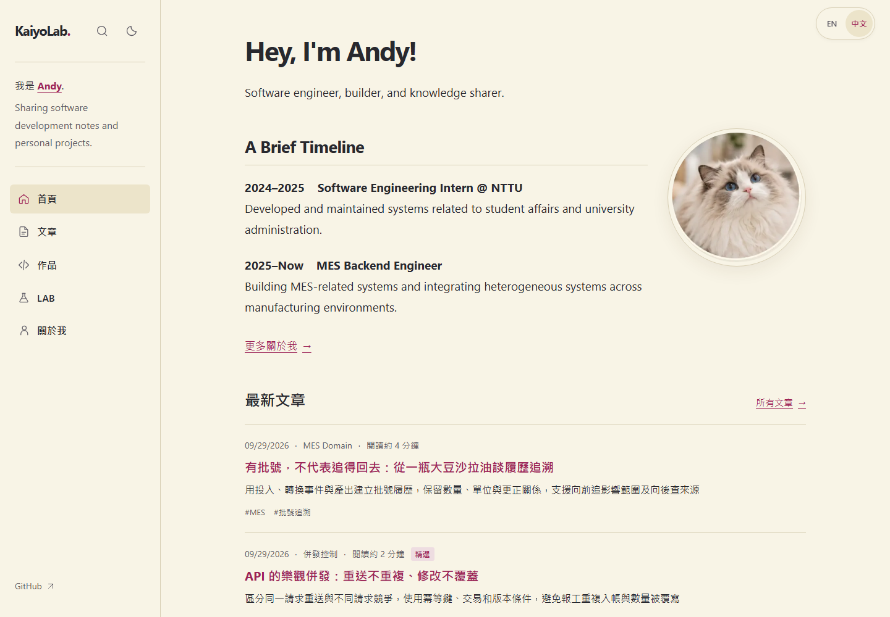

## 快速開始

需要已啟動的 Docker Engine 或 Docker Desktop（Linux 容器），以及 Docker Compose v2.24.4 以上，首次建置需要網路下載依賴與映像

下載專案並進入目錄：

```bash
git clone https://github.com/Andy61490963/KaiyoLab.git
cd KaiyoLab
```

**一行啟動前台、後台與資料庫：**

```bash
docker compose up -d
```

不必先建立 `.env`，首次啟動會建置應用程式、產生隨機密鑰、啟動 PostgreSQL 並執行資料庫 migration，之後啟動不會重設帳號或內容

1. 執行 `docker compose logs app`，取得「一次性初始化碼」
2. 開啟 [首次設定](http://localhost:4321/setup)，填入初始化碼、顯示名稱、網站名稱、Email 與密碼
3. 前往 [私人後台](http://localhost:4321/admin)，新增文章與作品

| 入口     | 本機網址                      |
| -------- | ----------------------------- |
| 公開網站 | <http://localhost:4321>       |
| 私人後台 | <http://localhost:4321/admin> |
| 登入     | <http://localhost:4321/login> |
| 首次設定 | <http://localhost:4321/setup> |
| LAB 工具 | <http://localhost:4321/lab>   |

初始化只允許建立一位站長，完成後關閉初始化及註冊入口，預設網站只綁定 `127.0.0.1`，對外提供服務請接著看[正式部署](docs/deployment.md)

檢查啟動狀態：

```bash
docker compose ps -a
docker compose logs --tail=100 app db
```

`init-secrets` 顯示 `Exited (0)` 是正常狀態，`app` 與 `db` 應持續執行並通過健康檢查，`backup-scheduler` 在應用程式就緒後啟動

## 功能

### 公開網站與閱讀

| 範圍       | 已提供的功能                                                                     |
| ---------- | -------------------------------------------------------------------------------- |
| 內容頁面   | 首頁、文章、作品、關於我及 LAB，首頁自介可整塊使用 Markdown 編輯                 |
| 尋找內容   | 分類、標籤、中文搜尋、多關鍵字與引號片語、分頁、手動／日期／標題排序             |
| 閱讀       | 文章目錄、閱讀時間、程式碼高亮與複製、Mermaid 流程圖與循序圖、相關文章及系列導覽 |
| 版面       | 明暗主題、桌面側欄、手機收合導覽、鍵盤操作及減少動態                             |
| 分享與索引 | RSS、sitemap、canonical、SEO、Open Graph，無封面時產生含中文標題的分享圖         |
| 發布資訊   | 分開保留首次發布與最後更新日期，修改已發布內容的網址後自動轉址                   |

文章、作品列表與內頁使用相同的網站外框及左側導覽寬度，桌面內容使用既有內容框的可用寬度，左右保留相同邊距，最大各 56px；文字段落保留行長限制，進入內頁時維持外框與內容起點，文章右欄的**目錄與相關文章一起固定**，手機改用折疊目錄

公開列表將搜尋與排序集中在同一列，排序的「預設順序」沿用站長設定，文章固定每頁 8 篇，作品與 LAB 固定每頁 12 筆；只有多頁才顯示頁碼與範圍，搜尋說明與標籤可展開，已選條件可分別移除

排序與篩選原地更新列表，保留焦點、閱讀位置與返回紀錄，載入失敗保留目前內容並提供重試，停用 JavaScript 時仍可透過搜尋表單與頁碼操作，詳見[搜尋、排序與分頁](docs/list-pagination.md)

尚無內容的作品頁只顯示空狀態，首頁空作品區與 LAB 空站長作品區不占版面；搜尋無結果時仍保留搜尋和清除入口

首頁介紹在「後台 → 關於我 → 首頁自我介紹（Markdown）」編輯，網站描述仍獨立用於搜尋引擎摘要，介面語言切換不會翻譯或改寫站長輸入的內容

### 編輯、發布與復原

| 範圍     | 已提供的功能                                                                     |
| -------- | -------------------------------------------------------------------------------- |
| 編輯器   | CodeMirror、Markdown 工具列、即時預覽、圖片插入、封面焦點、摘要、網址及 SEO 欄位 |
| 草稿     | 自動儲存、儲存狀態、本機草稿復原、失敗重試與多分頁編輯衝突提示                   |
| 發布     | 草稿與公開快照分離、發布前檢查、發布更新、下架、置頂                             |
| 版本紀錄 | 歷史快照、文字差異比較與還原成草稿，還原後仍需確認發布                           |
| 差異檢查 | Git 風格差異區塊，只顯示修改處及前後各 3 行，含舊新行號與增刪標記                |
| 垃圾桶   | 文章與作品可還原或確認永久刪除，永久刪除後無法從後台復原                         |
| 管理     | 內容總覽、分類標籤、媒體庫、品牌與社群設定、密碼變更                             |

**自動儲存不等於發布**：修改已發布文章時，訪客繼續看到上一個公開版本，直到按下「發布更新」並確認，草稿、私人預覽與管理 API 都要求站長登入

Markdown 支援表格、任務清單與程式碼區塊，渲染結果經 HTML 清理，不執行內容中的 JavaScript 或 MDX，使用「插入流程圖」可插入 Mermaid 範例，預覽與公開文章共用渲染流程，詳見 [Markdown 流程圖](docs/markdown-diagrams.md)

永久刪除會一併移除該內容的草稿、發布快照、版本紀錄與舊網址轉址，圖片仍保留在媒體庫，既有備份及先前下載的匯出檔也不會被回溯刪除

### 拖曳排序與媒體

- **直接拖曳整列**：文章／作品列表可按住標題或空白處拖曳，手機長按啟動，放開即儲存，短按標題仍可開啟編輯器
- **跨頁排序**：拖至上一頁末端／下一頁開頭，或停留在頁碼上翻頁，再放到指定列，也提供鍵盤排序及「移至…」指定全站位置
- **同步前後台**：完整列表預設依手動順序顯示，搜尋、分類篩選與其他排序下需先切回完整手動列表，首頁「最新文章」及 RSS 維持發布時間順序
- **圖片與動畫**：支援 JPEG、PNG、WebP、GIF，每張上限 10 MiB，統一儲存為 WebP，動畫保留影格時間與循環，縮圖與內容搬移也保留動畫
- **媒體管理**：批次上傳、搜尋、替代文字、使用位置及不同尺寸縮圖，仍被內容使用的圖片不可刪除

排序不會發布草稿，也不修改正文、內容版本或更新日期，另一分頁變更順序時會要求重新讀取，圖片動畫最多 200 幀，合計最多 4,000 萬解碼像素

後台保留每頁筆數調整，位於分頁旁，排序選單位於搜尋旁，排序說明按需展開，發布、下架與永久刪除的確認提示保留完整文字

### 語言、搬家與系統狀態

後台、登入及首次設定預設繁體中文，「中文／EN」可切換英文，選擇會保存並同步到其他後台分頁，與公開網站的語言偏好分開，切換時保留正在輸入的內容

- **內容搬家**：匯出文章、作品、版本紀錄、分類標籤、網站內容及圖片，匯入前預覽名稱與網址調整，匯入項目皆成為私人草稿，不覆蓋既有內容
- **系統狀態**：查看版本、資料庫連線、圖片目錄，以及已記錄的備份與還原驗證時間
- **維運**：Compose 每日完整備份、備份逾時與失敗提示、選用的加密異地副本，GitHub Actions 提供站外監測

內容搬家不包含帳號憑證及部署密鑰，來源站網址與舊網址別名僅供改寫內容連結，不會直接啟用原站轉址，需要完整保留登入與部署資料時，請使用[備份與還原](docs/backup-restore.md)，搬家流程及限制見[內容搬移](docs/content-transfer.md)

## LAB 互動實驗

[LAB](https://kaiyo.zeabur.app/lab) 先展示可以玩出的效果：畫粒子背景、讓形狀變換、滑動立體畫廊，再到動畫與版面實驗，使用滑鼠、手指或鍵盤即可操作，不需要先懂程式

入口預覽取自各工具的幾何與素材，滑鼠停留或鍵盤聚焦時提供短暫示範；內頁先呈現畫面、玩法和一鍵預設，精確參數與程式碼收在「進階設定與匯出」，製作原理可展開「看看怎麼做的」

五個實驗在瀏覽器執行，不會修改網站內容，既有前端工具與輸出功能均保留

| 工具                                                          | 操作                                             | 輸出                       |
| ------------------------------------------------------------- | ------------------------------------------------ | -------------------------- |
| [畫一張粒子背景](https://kaiyo.zeabur.app/lab/flow-field)     | 套用風格、吸引／排斥粒子，進階可調整種子與粒子數 | 目前畫面的 PNG 與設定 JSON |
| [讓形狀變個樣](https://kaiyo.zeabur.app/lab/svg-studio)       | 換輪廓與填色、播放 A／B 變形，進階可編輯節點     | 目前形狀的靜態 SVG         |
| [滑動立體畫廊](https://kaiyo.zeabur.app/lab/kinetic-carousel) | 拖拉卡片、切換三種視角，進階可調整透視與景深     | 外觀參數及繪製函式         |
| [讓方塊彈一下](https://kaiyo.zeabur.app/lab/motion-studio)    | 選動作、播放或拖動時間軸，進階可調整 Bézier 曲線 | CSS 動畫                   |
| [拼出你的版面](https://kaiyo.zeabur.app/lab/grid-studio)      | 套用版型、拖拉區塊、切換裝置寬度，進階可調整行列 | 響應式 HTML／CSS           |

輪播輸出需自行整合卡片與手勢控制，粒子 JSON 是設定，並非完整動畫程式，SVG 不包含變形動畫，工具狀態不會自動保存，離開前請複製或下載結果

所有工具沿用明暗與中英文切換，支援鍵盤、觸控及減少動態，使用 CSS、SVG、Canvas 與 React，完整說明見 [LAB 工具架構與驗證](docs/lab-engineering.md)

要加入自己的實驗，可在「後台 → 作品」選擇 **LAB** 分類並發布，內容會出現在 LAB 的「站長作品」區，也保留在作品列表，支援草稿、手動排序、搜尋、分頁與詳細頁

## 實際畫面

首頁截圖取自正式網站，其餘功能截圖使用本機測試資料，文章、作品及站長資料可自行替換

<details>
<summary>公開網站、後台與編輯流程</summary>

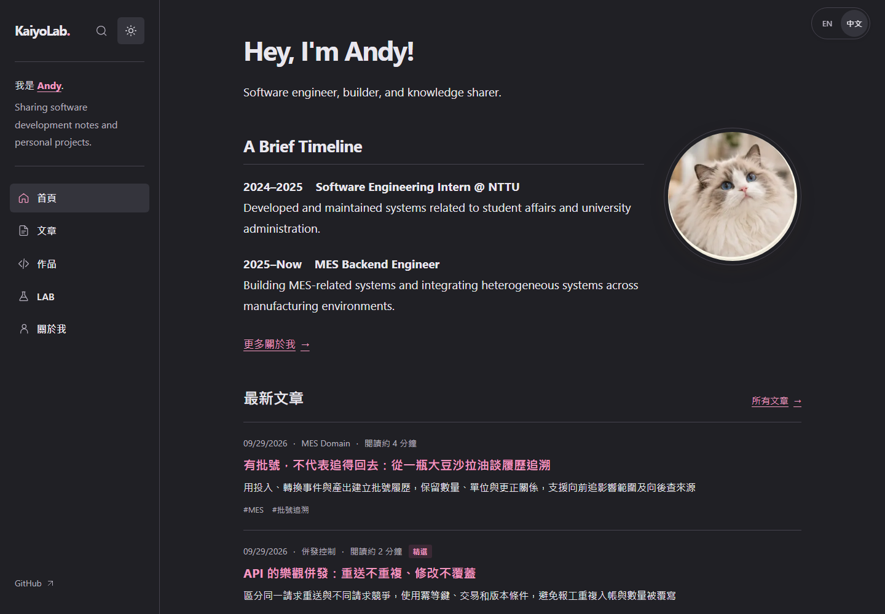

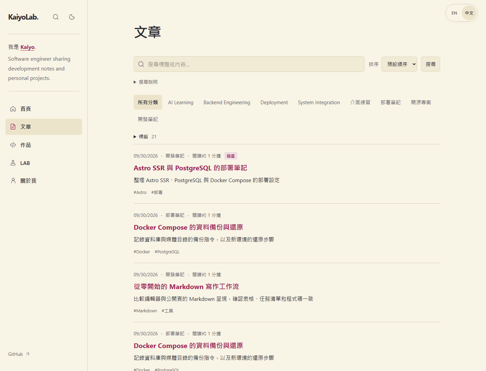

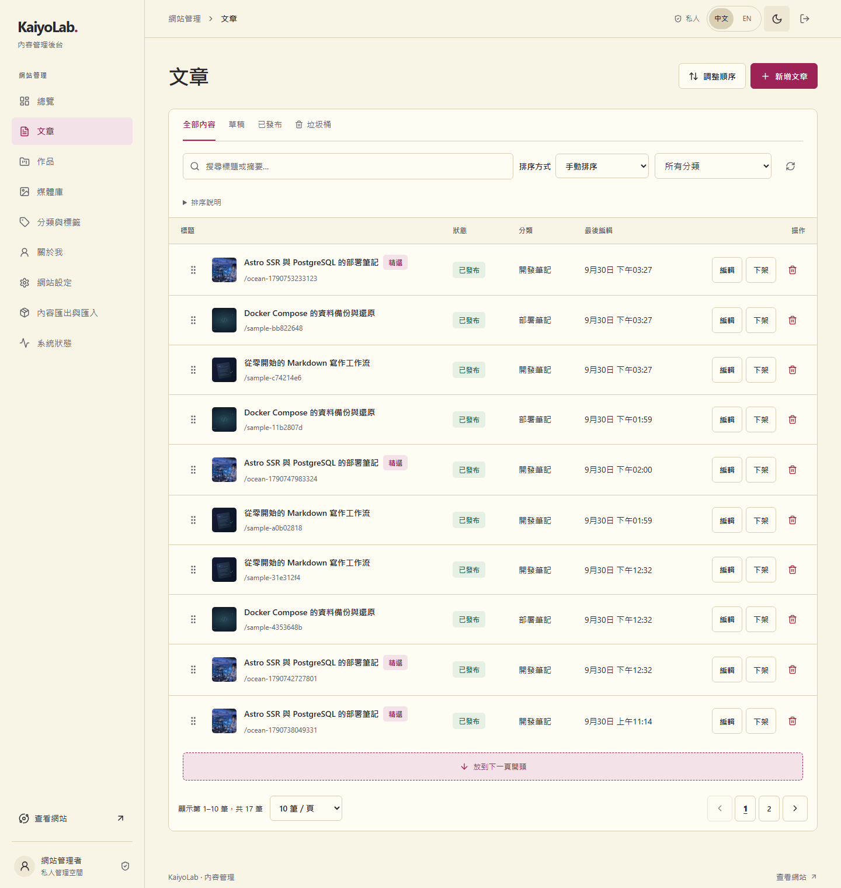

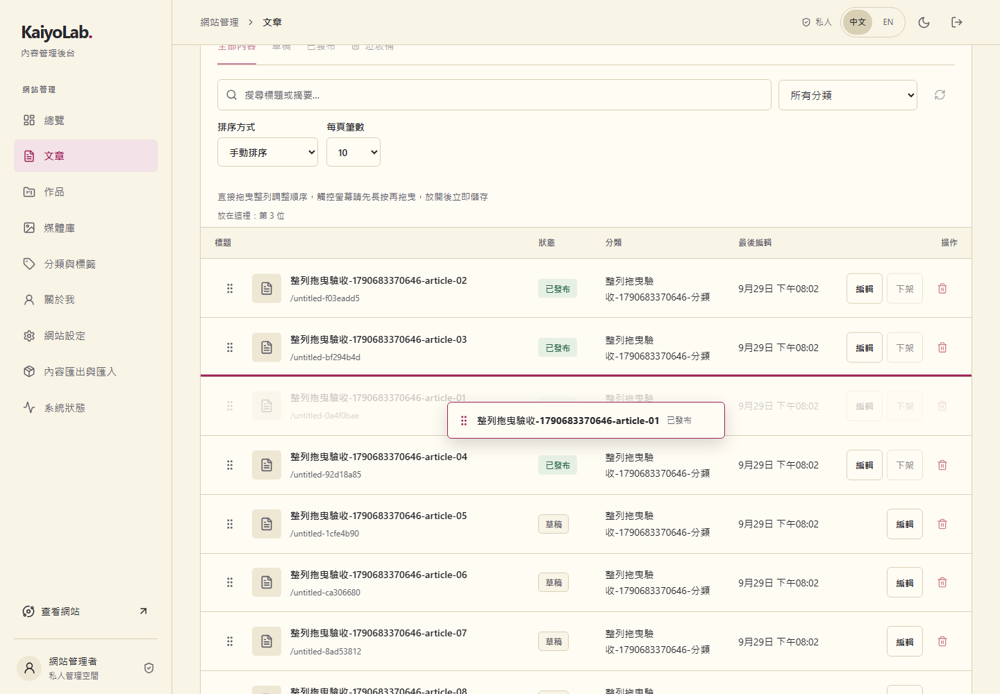

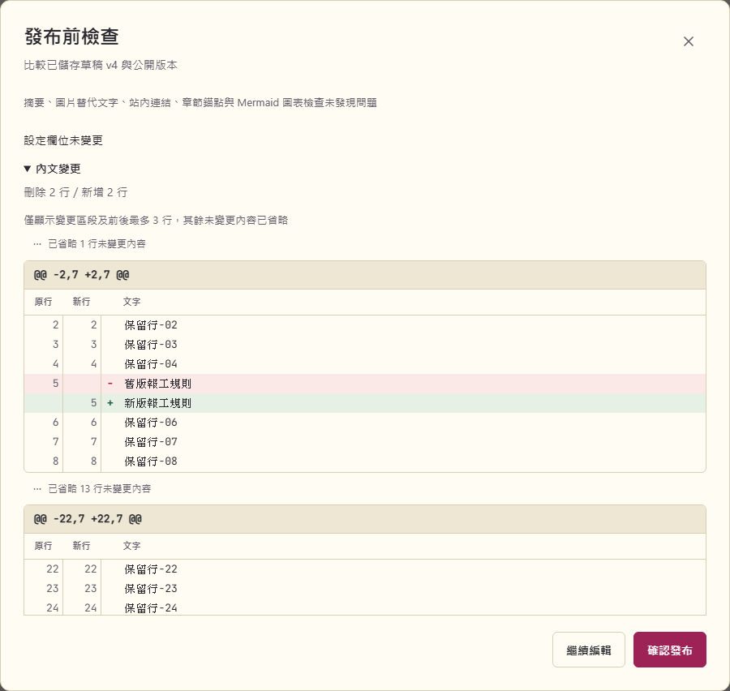

</details>

<details>
<summary>LAB 互動實驗與預覽</summary>

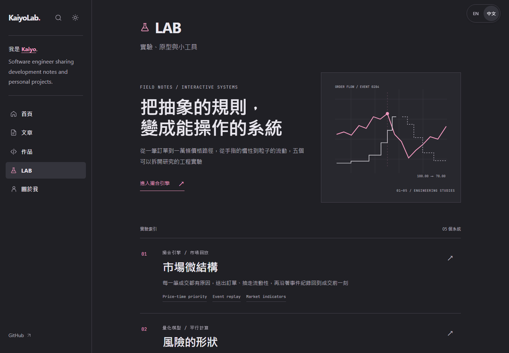

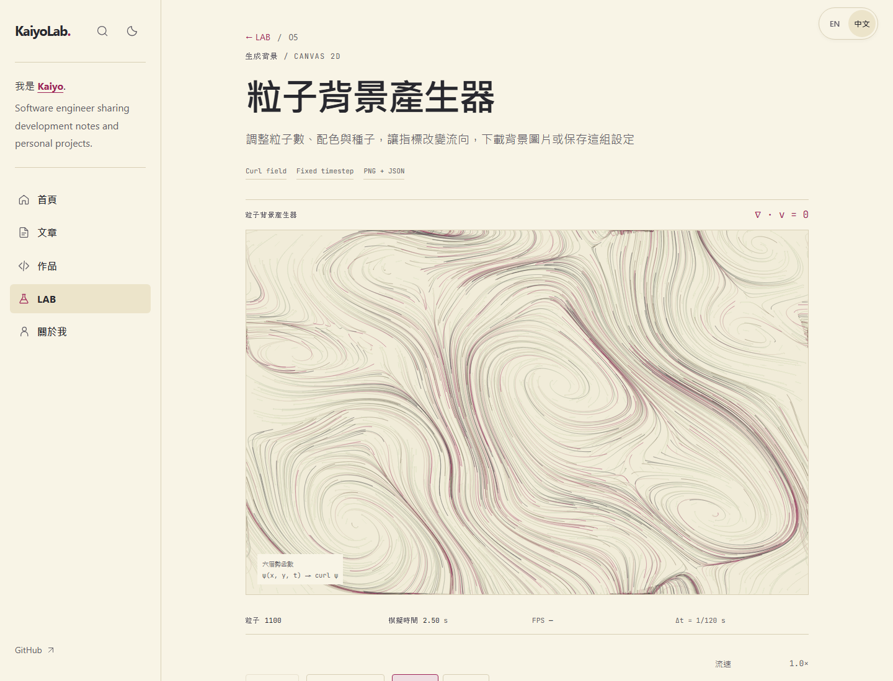

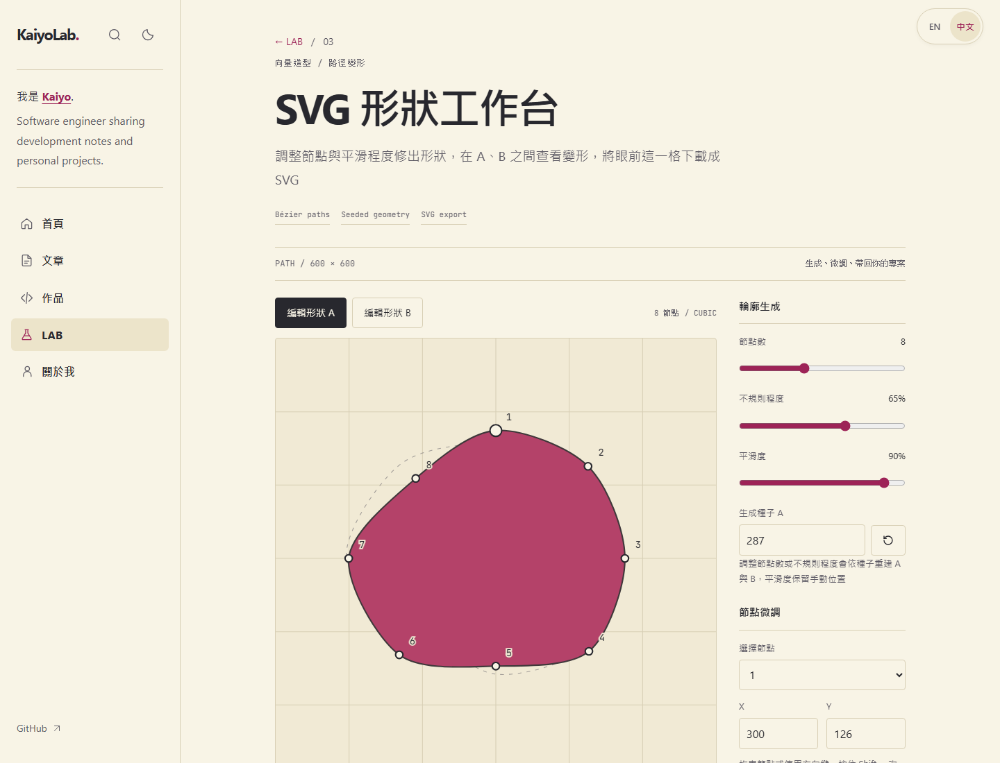

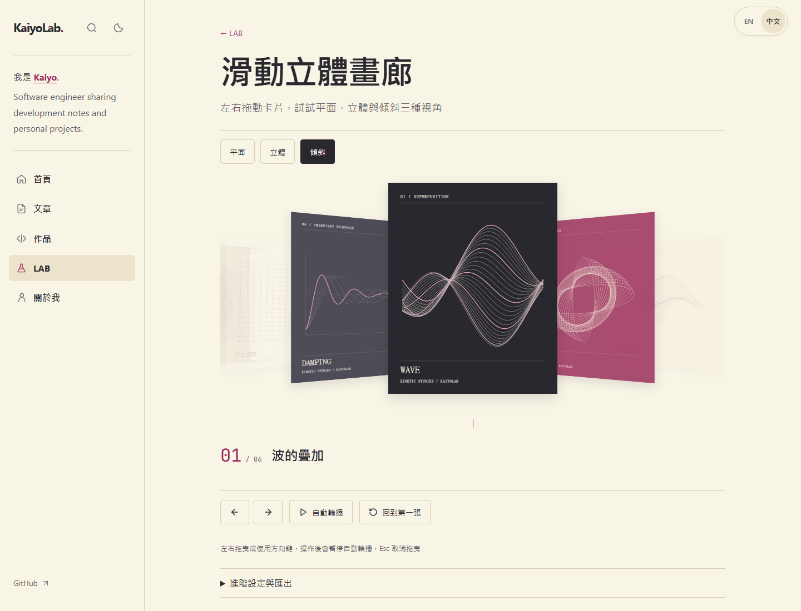

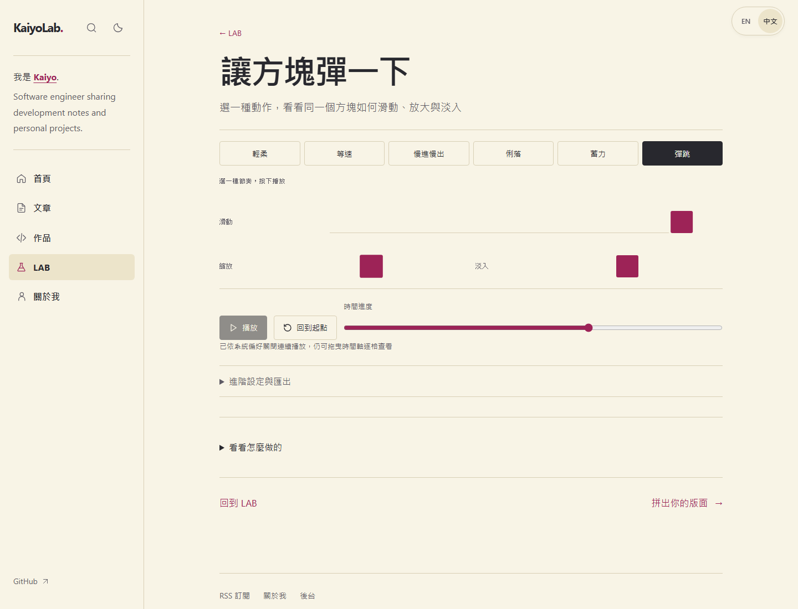

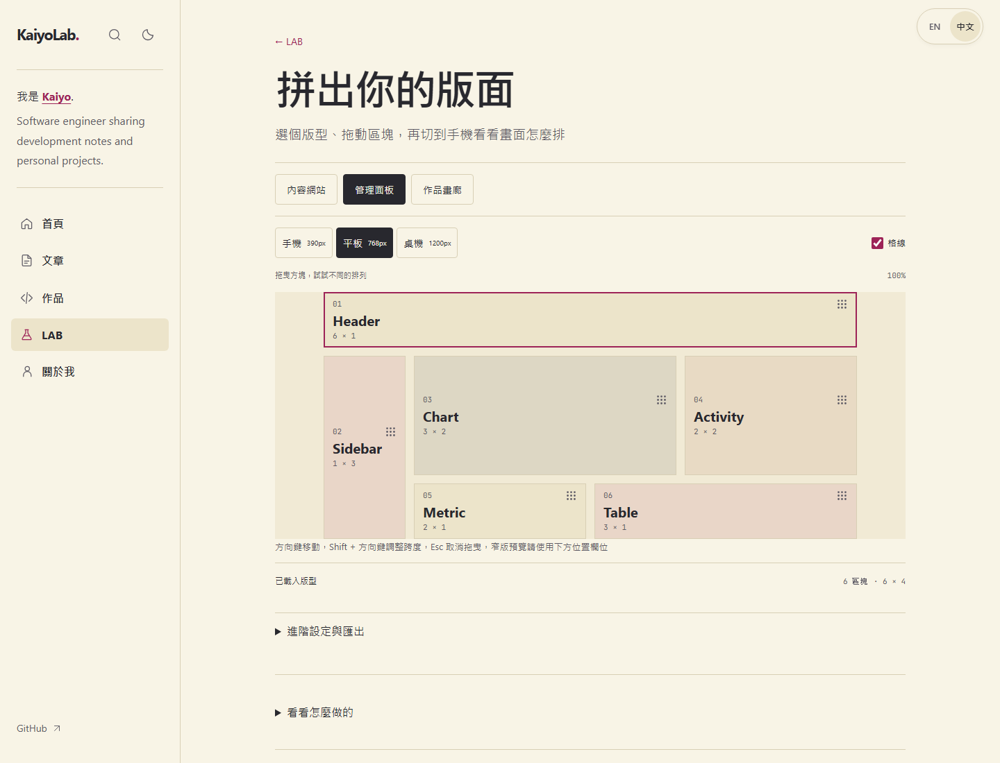

</details>

## 技術架構

| 層級       | 技術                                                                  |
| ---------- | --------------------------------------------------------------------- |
| 應用程式   | Astro 7、TypeScript、官方 Node adapter、SSR                           |
| 互動介面   | React islands、Tailwind CSS、Radix UI、Lucide、dnd-kit                |
| 內容渲染   | CodeMirror、remark／rehype、Shiki、Mermaid                            |
| 資料       | PostgreSQL 18、Drizzle ORM、版本化 SQL migration                      |
| 登入       | Better Auth Email／密碼、資料庫 Session、單一站長                     |
| 執行與部署 | Node.js 24、Docker Compose、非 root 應用程式程序                      |
| 品質驗證   | Astro check、Vitest、PostgreSQL 整合測試、Playwright、Docker 備份還原 |

```text
瀏覽器 → Astro 應用程式容器 → PostgreSQL 容器 → pg_data volume
           前台／後台／API  → 圖片檔案 → uploads volume
首次初始化服務 → secrets volume → 應用程式與資料庫
backup-scheduler → 資料庫、圖片、密鑰 → 主機 backups/ 目錄
```

前台、後台與 API 由同一個應用程式容器提供，資料庫不對主機公開連接埠，應用程式根檔案系統唯讀，圖片與密鑰獨立持久化，PostgreSQL 18 掛載於 `/var/lib/postgresql`

| 類型       | 路由                                                                                                            |
| ---------- | --------------------------------------------------------------------------------------------------------------- |
| 公開內容   | `/`、`/articles`、`/articles/[slug]`、`/projects`、`/projects/[slug]`、`/about`                                 |
| 前端工具   | `/lab`、`/lab/motion-studio`、`/lab/grid-studio`、`/lab/svg-studio`、`/lab/kinetic-carousel`、`/lab/flow-field` |
| 索引與健康 | `/rss.xml`、`/sitemap.xml`、`/api/health`                                                                       |
| 管理與登入 | `/admin/*`、`/login`、`/setup`                                                                                  |
| API        | `/api/auth/*`、`/api/admin/*`、`/api/setup`                                                                     |

## 部署與維運

### 環境設定

本機 Compose 預設不需 `.env`，自訂時可複製 [.env.example](.env.example)，以下變數會由 Compose 讀取：

| 變數                      | 預設值                  | 用途                                                                  |
| ------------------------- | ----------------------- | --------------------------------------------------------------------- |
| `SITE_URL`                | `http://localhost:4321` | 建置及執行期的完整網址，變更後須重新建置                              |
| `APP_PORT`                | `4321`                  | 本機對應連接埠，變更時同步更新 `SITE_URL`                             |
| `DOMAIN`                  | 無                      | 使用 `compose.production.yaml` 時指定 HTTPS 網域，統一覆寫 `SITE_URL` |
| `BACKUP_INTERVAL_SECONDS` | `86400`                 | 自動備份週期，範圍 60–2678400 秒                                      |
| `BACKUP_RETENTION_DAYS`   | `14`                    | 本機完整備份保留天數                                                  |
| `BACKUP_MAX_AGE_HOURS`    | `36`                    | 後台標示備份逾時的門檻，應大於備份週期                                |

直接使用 Node 開發或自行管理容器時，還需設定 `DATABASE_URL`、`BETTER_AUTH_SECRET`、`SETUP_TOKEN`、`UPLOAD_DIR`，維運紀錄使用選填的 `OPERATIONS_DIR`，範例見[本機開發](docs/development.md)與 [Zeabur 部署](docs/zeabur.md)

Compose 不會把 `.env` 全部變數自動傳進容器，預設密鑰由 `secrets` volume 提供，掛載於 `/run/kaiyo-secrets`，圖片位於 `/app/data/uploads`，不要只替換資料庫或密鑰其中一個 volume

### 公開網域與 CI/CD

正式部署需設定網域、HTTPS 與可信代理來源，使用隨附 Caddy 時，在 `.env` 設定 `DOMAIN=你的網域`，確認 DNS 及 80／443 連接埠後執行：

```bash
docker compose -f compose.yaml -f compose.production.yaml up -d --build --wait
```

更換網域後必須重新建置，建置時與執行期的站點網址需一致，已有代理及 Zeabur 的設定步驟見[正式部署](docs/deployment.md)與 [Zeabur 與 CI/CD](docs/zeabur.md)

- PR 與 `main`：型別、核心規則、資料庫、Docker 全新啟動、瀏覽器流程、容器重建及備份還原驗證
- 正式部署：設定 `PRODUCTION_URL` 後，驗證指定 commit 已上線、公開頁面及私人 API 邊界
- 外部監測：設定 `PRODUCTION_URL` 後定期檢查網站，通知依 GitHub Actions 通知設定，排程可能延遲
- 版本發布：推送 `v*` 標籤，通過驗證後建立 GHCR 的 amd64／arm64 映像

通用 GHCR 映像以本機 HTTP 網址建置，**自己的 HTTPS 網域仍須從原始碼建置**，可用版本以實際發布紀錄為準，驗證結果請查看 [GitHub Actions](https://github.com/Andy61490963/KaiyoLab/actions)

### 資料保存、備份與復原

| 操作           | 指令／行為                                             |
| -------------- | ------------------------------------------------------ |
| 停止並保留資料 | `docker compose down`                                  |
| 再次啟動       | `docker compose up -d`                                 |
| 立即完整備份   | `docker compose --profile maintenance run --rm backup` |
| 查看排程備份   | `docker compose logs --tail=100 backup-scheduler`      |
| 復原站長密碼   | `docker compose exec app npm run account:recover`      |

`pg_data`、`uploads`、`secrets` 保存在 Docker volumes，重建容器仍保留資料，**`docker compose down -v` 會刪除這些 volumes**，主機 `backups/` 目錄中的既有備份不會隨之刪除

Compose 預設每 24 小時備份資料庫、圖片及密鑰到 `backups/`，保留約 14 天，同機備份無法處理整台主機遺失，異地加密副本需另行設定目的地，Zeabur 不會自動執行 Compose 的排程容器，請依[備份與還原](docs/backup-restore.md)設定適用的備份方式

密碼復原會產生新隨機密碼並使既有 Session 失效，不需寄信服務，登入後可在後台變更密碼，請勿公開復原輸出或包含帳號、私人內容與密鑰的備份

### 升級與回復

1. 建立包含資料庫、圖片與密鑰的完整備份
2. 更新到指定版本標籤或 commit
3. 執行 `docker compose up -d --build --wait`，正式 Caddy 部署需保留相同的 `-f` 參數
4. 檢查 `/api/health`、首頁、登入與圖片

Migration 失敗會阻止應用程式啟動，先查看日誌，回退程式不會自動逆轉資料庫結構，遇到不相容變更時，將更新前的備份還原到新的 Compose 專案，驗證後再切換流量，詳見[備份與還原](docs/backup-restore.md)

## 開發與測試

需要 Node.js 24 與 PostgreSQL 18，建立專用開發資料庫，將 `.env.example` 複製為 `.env`，設定資料庫連線、獨立隨機密鑰、初始化碼、圖片目錄與 `SITE_URL=http://localhost:4321`

```bash
npm ci
node --env-file=.env scripts/migrate.mjs
npm run dev
```

`npm run dev` 會載入 `.env` 並以前景模式啟動，按 Ctrl+C 停止，修改資料結構時新增 migration，不修改已發布的 migration

型別、核心規則、資料庫與正式建置：

```bash
npm run check
npm test
node --env-file=.env node_modules/vitest/vitest.mjs run tests/integration
node --env-file=.env node_modules/astro/bin/astro.mjs build
```

整合測試需要 `DATABASE_URL` 與可建立測試資料庫的帳號，缺少連線設定時會略過，不應視為已通過資料庫驗證

瀏覽器測試另建 `.env.test`，使用**獨立的空白測試資料庫與圖片目錄**，設定 `E2E_EMAIL`、`E2E_PASSWORD`，並先停止占用 4321 的開發網站：

```bash
node --env-file=.env.test scripts/migrate.mjs
npx playwright install chromium
node --env-file=.env.test node_modules/@playwright/test/cli.js test
```

瀏覽器測試會建立站長、文章、作品並操作設定，不可對正式網站執行，沿用已初始化測試站時，測試帳密需與站長相符，環境範例及完整指令見[本機開發與測試](docs/development.md)

## 常見問題

**管理頁面在哪裡？**

在自己的網站網址後加 `/admin`，未登入會轉到 `/login`，尚未初始化時先開 `/setup`

**初始化碼在哪裡？**

本機執行 `docker compose logs app`，Zeabur 則查看應用程式服務的執行日誌，初始化完成後重啟不再顯示代碼，忘記密碼請使用帳號復原指令

**第一次啟動後打不開？**

確認 Docker Engine 已啟動且使用 Linux 容器，等待映像建置完成，再以 `docker compose ps -a` 與 `docker compose logs --tail=100 app db` 查看狀態，不要刪除 volumes 排錯

**更換本機 port 後無法登入？**

同步設定 `APP_PORT=8080` 與 `SITE_URL=http://localhost:8080`，再執行 `docker compose up -d --build --wait`，瀏覽器網址需與設定來源一致

**文章編輯後為什麼還沒公開？**

自動儲存只更新草稿，已發布內容需按「發布更新」並確認，歷史版本還原與內容匯入也不會自動發布

**為什麼不能拖曳排序或刪除圖片？**

拖曳需使用「全部」且依手動順序顯示，先清除搜尋與分類篩選，垃圾桶不提供排序，圖片若仍被內容引用，需先移除引用後再刪除

## 文件索引

| 目的                     | 文件                                         |
| ------------------------ | -------------------------------------------- |
| HTTPS、網域與代理        | [正式部署](docs/deployment.md)               |
| Zeabur、版本驗證與監測   | [Zeabur 與 CI/CD](docs/zeabur.md)            |
| 備份、異地副本與災難復原 | [備份與還原](docs/backup-restore.md)         |
| 匯出、匯入與搬家限制     | [內容搬移](docs/content-transfer.md)         |
| 版本紀錄與系統狀態       | [內容復原及維運](docs/maintenance.md)        |
| Mermaid 範例與限制       | [Markdown 流程圖](docs/markdown-diagrams.md) |
| 公開列表與後台分頁       | [搜尋、排序與分頁](docs/list-pagination.md)  |
| LAB 架構、匯出與驗證     | [LAB 前端工具](docs/lab-engineering.md)      |
| 開發環境與測試           | [本機開發與測試](docs/development.md)        |
| 回報問題與貢獻           | [貢獻指南](CONTRIBUTING.md)                  |

## 範圍與授權

目前適合**一個網站、一位站長**，不提供公開註冊、留言、電子報、多租戶、排程發布或拖拉式頁面編排，歷史版本從功能啟用後累積，不會補回升級前的文字，也不保存每一次按鍵

程式碼採 [MIT 授權](LICENSE)，保留原有授權聲明，字體及第三方套件依各自授權，字體隨專案提供，不依賴第三方字體 CDN

公開網站的排版與色彩參考 [Tania Rascia 的作品頁](https://www.taniarascia.com/projects/)，介面自行實作，未使用對方的文章、圖像或程式碼，初版視覺曾參考 [cod-aquarium](https://github.com/Codfisher/cod-aquarium)，素材來源及授權詳見[素材與第三方授權](docs/credits.md)及[視覺素材來源](docs/assets.md)
