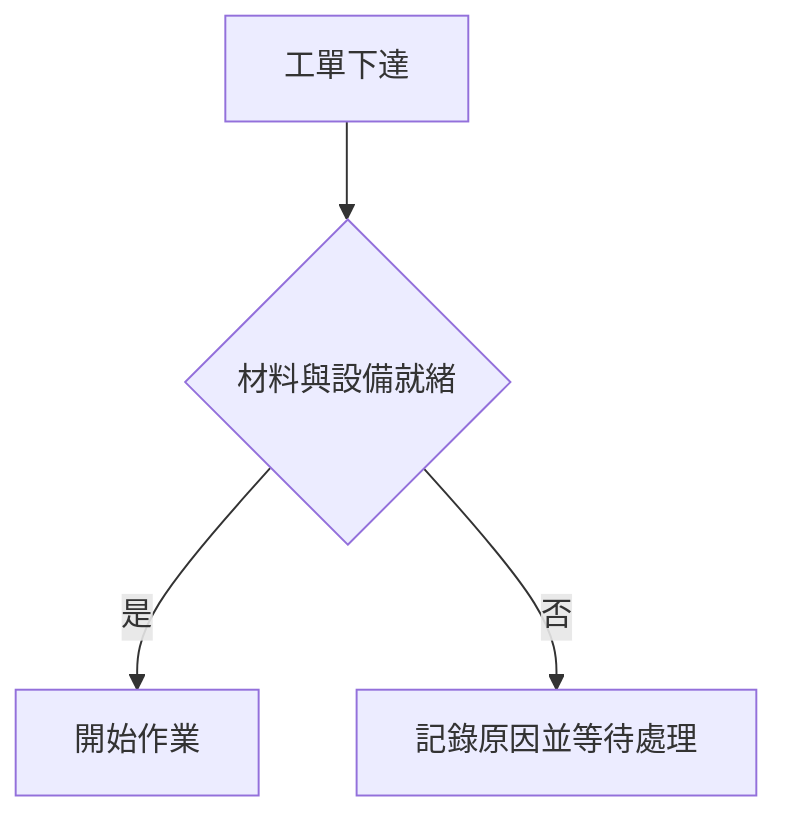
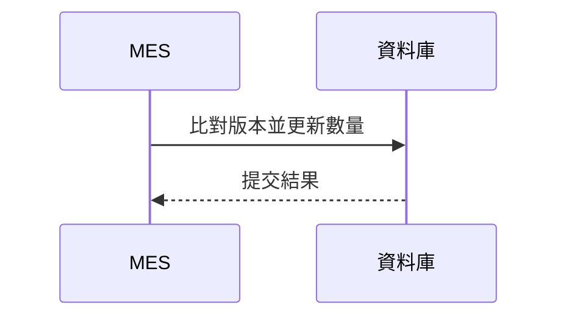
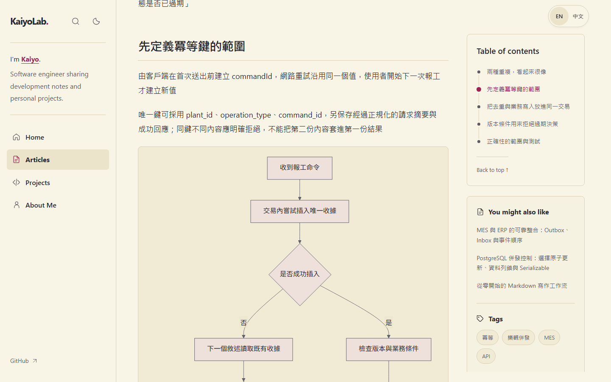
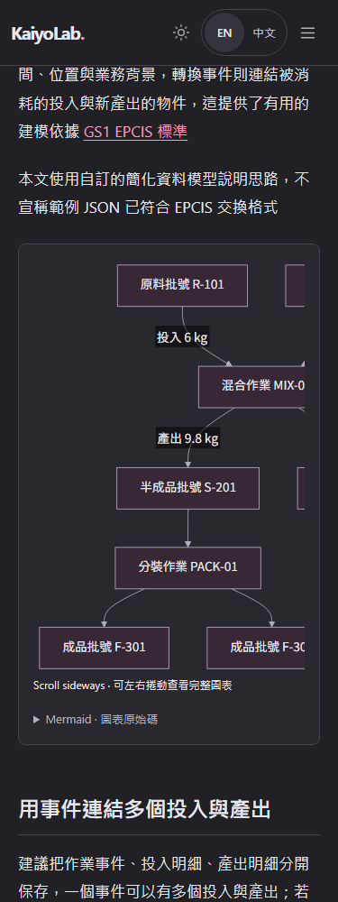

# Markdown 流程圖

在文章編輯器按 **Insert flowchart**，或直接輸入下列 Markdown，預覽與公開文章都會顯示圖表

````markdown
## 開工作業


````

也可使用 `sequenceDiagram` 說明報工、交易與跨系統訊息的先後順序

````markdown

````

## 排版與閱讀





- 圖表沿用網站明暗配色，不需要另外指定顏色
- 手機版會在圖表區域內橫向捲動，避免撐寬整篇文章
- 圖表下方可展開 Mermaid 原始碼；鍵盤可操作來源與捲動區域
- 尚未載入 JavaScript 或語法有錯時，仍保留可讀取的原始碼
- 只有含圖表且接近畫面的內容才載入 Mermaid，不把圖表程式套到所有閱讀頁
- 文章目錄與「你可能也喜歡」會一起固定在右欄，接近整篇文章底部才隨文章離開；側欄超過視窗高度時，兩個面板共用一層捲動區，手機維持折疊目錄

## 支援範圍

支援 `flowchart`、`graph` 與 `sequenceDiagram`，每張來源上限 12,000 字元、最多 120 條邊

不支援圖內初始化指令、YAML 設定、HTML、外部圖片、連結點擊或自訂 CSS，相關語法會保留原始碼並提示無法顯示，不會執行文章中的程式

渲染使用 Mermaid 的 `strict` 模式與關閉的 HTML labels，再清理產生的 SVG，公開頁與私人預覽共用流程

語法參考 [Mermaid 官方文件](https://mermaid.js.org/intro/syntax-reference.html)，安全設定參考 [Mermaid securityLevel](https://mermaid.js.org/config/schema-docs/config-properties-securitylevel.html)

## MES 與併發控制範例

[六篇範例文章](articles/mes-series.json)包含 MES 系統邊界、工單狀態機、批號履歷、冪等與樂觀併發、PostgreSQL 鎖與隔離、Outbox／Inbox

文章是教學模型，不是特定工廠的操作規範，引用來源列在各篇內文；此 JSON 保存文稿，不會在更新網站或執行 migration 時自動取代站長內容

## 本機驗證

```bash
npx vitest run tests/diagrams.test.ts
npx playwright test tests/e2e/zzzzzzz-diagrams.spec.ts tests/e2e/zzzzzzz-article-outline.spec.ts
```

使用 Playwright 專用 Chromium，不使用系統 Edge；首次執行可用 `npx playwright install chromium --only-shell` 安裝，請勿設定指向 `msedge.exe` 的 `PLAYWRIGHT_CHROMIUM_EXECUTABLE`
